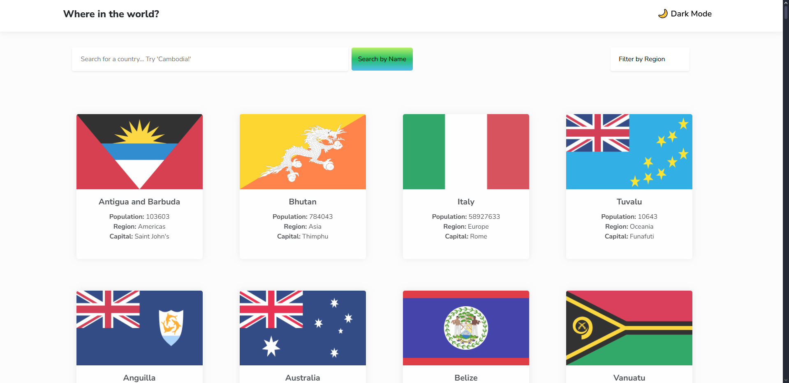
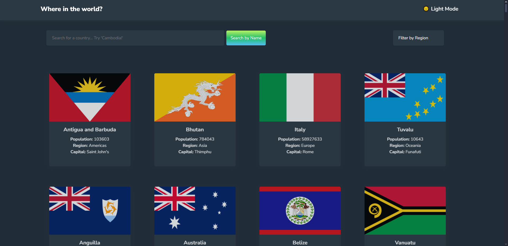
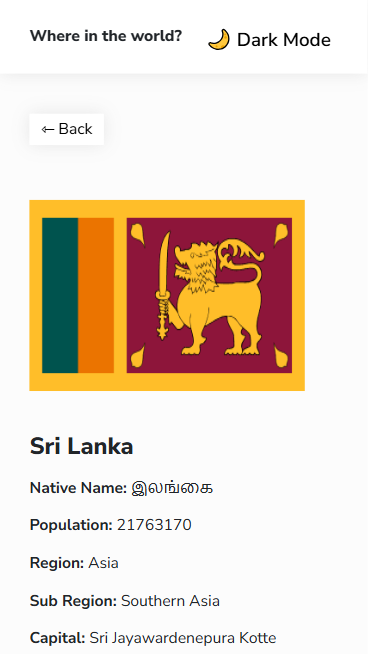
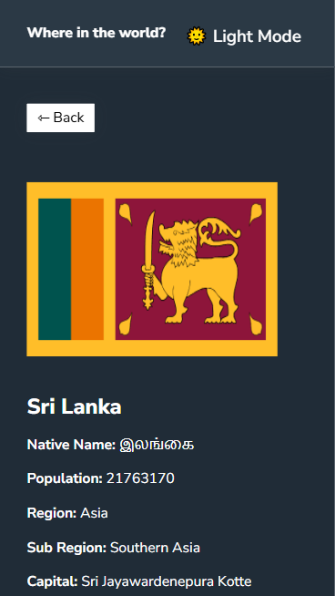
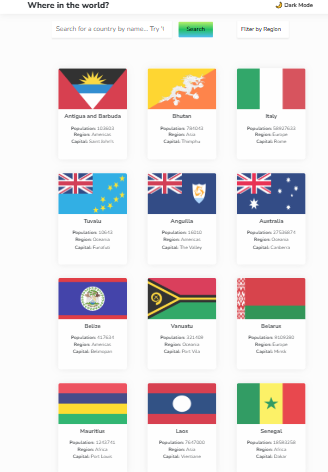
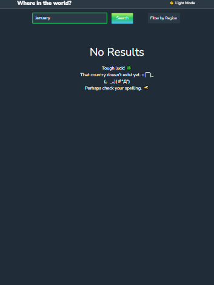

# Where in the World? 🌎 | React Version
## Overview
This is a solution to the [REST Countries API with color theme switcher challenge on Frontend Mentor](https://www.frontendmentor.io/challenges/rest-countries-api-with-color-theme-switcher-5cacc469fec04111f7b848ca). Additionally, this project aims to assess my ability to build responsive interactive applications using React and TypeScript. I am also challenging myself to show my ability to refactor code from Vanilla JS, HTML, and CSS to TypeScript, JSX, and React (I'm still using Bootstrap and CSS though). 

------------------------------------------------
## Table of contents

- [Overview](#overview)
  - [GitHub](#github)
  - [The challenge](#the-challenge)
  - [Link to Website](#view-live-website)
  - [Previews](#previews)
  - [My process](#my-process)
  - [Built with](#built-with)
  - [Reflection Questions](#reflection-questions)
  - [Useful resources](#useful-resources)
- [Author](#author)

### GitHub Link

https://github.com/ANIO-Official/react-where-in-the-world 

### The challenge

Users should be able to:

- See all countries from the API on the homepage
- Search for a country using an `input` field
- Filter countries by region
- Click on a country to see more detailed information on a separate page
- Click through to the border countries on the detail page
- Toggle the color scheme between light and dark mode *(optional)*

### View Live Website


### Previews
**DESKTOP**





**MOBILE**




**TABLET**





## My process
Brief about my process. Here are my steps:

 1. NPM, Vite, and TS installation. Git init.

  - `npm create vite@latest`
  - Setup: Naming Folder > React > TypeScript + SWC
  - `git init` in bash terminal within VSCode.

 2. Moving and Reorganizing the Original Code

  - Removed unnecessary CSS from React Vite Template.
  - Separated original CSS & HTML file by pages and components.

 3. Refactored to JSX, React useState, useEffect, etc.

  - Refactored HTML code to JSX. Separated HTML code for main page and detailed page into React Page components.
  - Refactored Javascript code into Typescript code to add functionality to the application.
  - Created BorderCountry Button, Card, Navbar, and SearchAndFilterBar components for use in Pages.
  - Moved the filter value into useState statevariable to manage it's updates.
  - Created useFetch custom hook and called it to render the data recieved as country cards (both all and filtered).
  - Created FilterContext to provide the filter value & ThemeContext to provide the current theme to all necessary components without prop drilling.
  - Created ContextProvider to wrapp the app with both created contexts.
  - Created types and interface for type checking.
  - Created reusable utility functions for use in Detailed Country page.

 4. React Routing

  - `npm react-router-dom`
  - Set up route wrapper and routes for main(landing) and detailed country page in App.tsx.

 5. Testing, Bug Fixing, Styling Adjusments, Responsive Design Adjustments.

  - Console.log to check values and ensure correct values are accessed.
  - Cross referenced API Links and documentation to ensure data is accessed and displayed correctly.
  - Adjusted Styling issues with margins, padding, height, width, etc.
  - Added NotFoundPage to handle edge-case of users trying to navigate to invalid urls. 

 5. File Organization, Final Testing to ensure Errors Appear, & Any additional touch ups or Bug Fixes.

  - Moved Utility functions and types to separate files and folders.
  - Used React Google Chrome plugin to check components and look for errors in specific locations. Also to check keys.
  - Used Google Chrome Dev Tools for Mobile and Tablet adjustments.
  - Made styling adjustments using Bootstrap and Vanilla CSS. 

### Built with

  - React
  - JSX
  - Vue
  - TypeScript
  - Bootstrap
  - CSS

## Reflection
 **Development Process**

 

 You can read more about my process above at [My process](#my-process).
 
 **Challenges faced**
  
  A challenged I faced occured when I tried typing the data recieved while fetching. Due to using ane empty array, multiple errors occured when trying to access data later when using the .map() method. It resulted in the warning below:

 `Property 'cca3' does not exist on type 'never'.ts(2339)`

 I wanted to keep the array general in order to accept data of different urls without being *too specific* which caused me type errors. I want the fetch to work with different arrays container different properties **without** needing to make an interface for each different kind of array to expect and **without** needing to check the url to determine the default values for the data.


 **Solutions implemented**
  
  ```
 
  ```

**Potential improvements**

 

### Useful resources

--------------------------------------------------------

**Styling**

- [MDN | Transform CSS property](https://developer.mozilla.org/en-US/docs/Web/CSS/Reference/Properties/transform)
- 

**General Coding & Styling**

- [Your Next Meal App | Referenced Previous Code](https://github.com/ANIO-Official/your-next-meal-app/blob/main/src/components/FavoriteRecipePrev.jsx)
- [Where in the World | Vanilla Code](https://github.com/ANIO-Official/where-in-the-world/tree/main/where-in-the-world-main)
- [Context API Implementation Todo App | Referenced Context & Providers](https://github.com/ANIO-Official/context-api-implementation/blob/main/src/components/TodoProviders.tsx)
- [Stack Overflow | Property does not exist on type never](https://stackoverflow.com/questions/44147937/property-does-not-exist-on-type-never)
- [MDN | hasOwnProperty](https://developer.mozilla.org/en-US/docs/Web/JavaScript/Reference/Global_Objects/Object/hasOwnProperty)
- [MDN | CSS Scle Property](https://developer.mozilla.org/en-US/docs/Web/CSS/Reference/Values/transform-function/scale)


**React Router**

- [Codevolution | React Router (Review/Syntax check)](https://www.youtube.com/watch?v=UyHHmPvVEfI&list=PLC3y8-rFHvwjkxt8TOteFdT_YmzwpBlrG&index=6)
- [React Router Docs | (Review/Syntax check)](https://reactrouter.com/start/declarative/routing)

--------------------------------------------------------

**API DOCUMENTATION**
- [REST Countries API | Using Endpoints: Codes](https://restcountries.com/#endpoints-code)
- [REST Countries API | Gitlab | Available Fields](https://gitlab.com/restcountries/restcountries/-/blob/master/FIELDS.md)

## Author

- LinkedIn - [Amanda Ogletree](https://www.linkedin.com/in/amanda-ogletree-a61b60168)